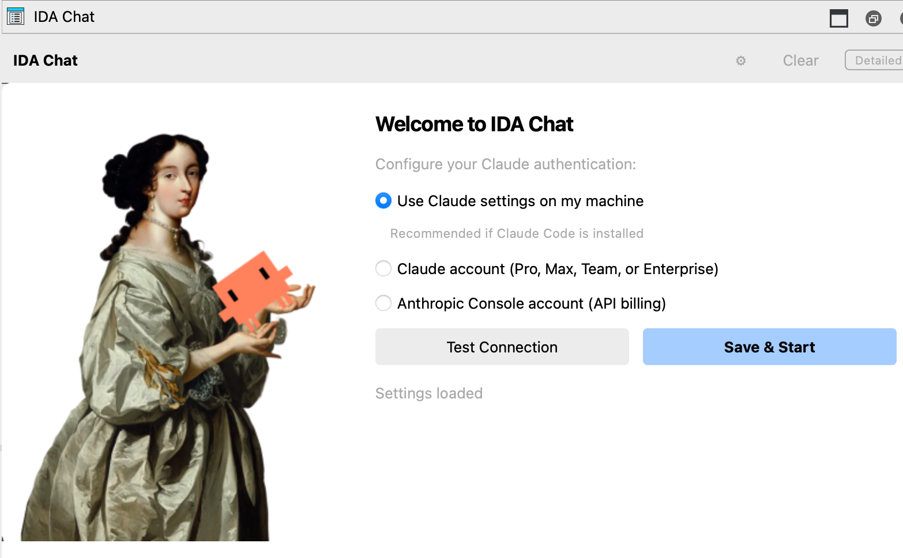
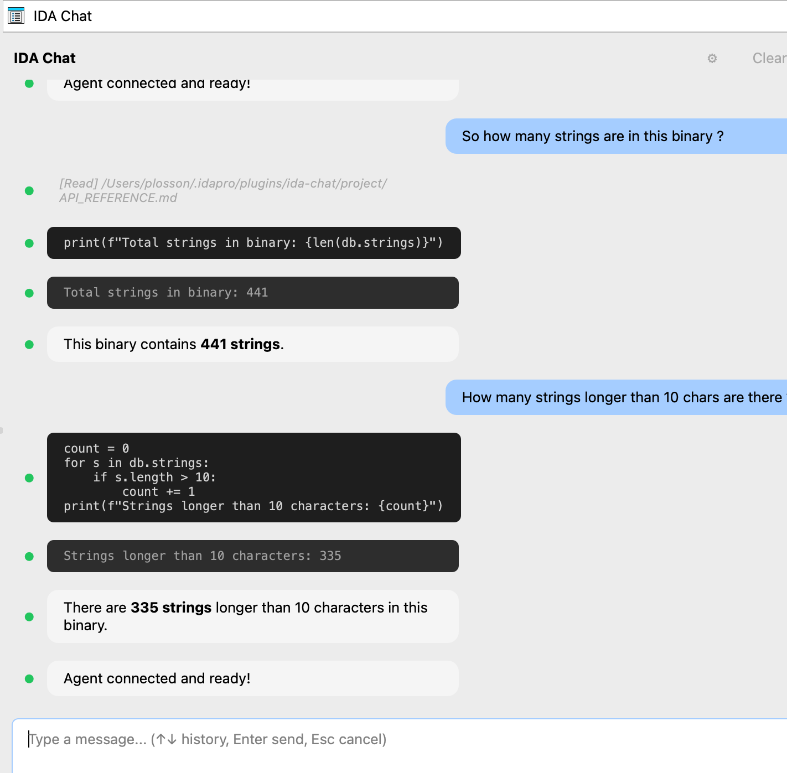

# IDA Chat Plugin

An AI-powered chat interface for IDA Pro using Claude Agent SDK. Ask questions about your binary and get intelligent analysis powered by Claude.



## Features

- Dockable chat widget inside IDA Pro (Ctrl+Shift+C to toggle)
- AI-powered binary analysis using Claude
- Automatic script generation and execution
- Markdown rendering for formatted responses
- Persistent chat history per database

## Requirements

- IDA Pro 9.0 or later
- `hcli` (Hex-Rays CLI tool)

## Installation

1. Download the latest release (`ida-chat.zip`) from the [releases page](https://github.com/HexRaysSA/ida-chat-plugin/releases)

2. Install with hcli:
   ```bash
   hcli plugin install ida-chat.zip
   ```

3. On first launch, the setup wizard will guide you through authentication. You can also configure via command line:
   ```bash
   # Option 1: System authentication (recommended - uses Claude Code credentials)
   hcli plugin install ida-chat.zip --config auth_type=system

   # Option 2: API key
   hcli plugin install ida-chat.zip --config auth_type=api_key --config api_key=YOUR_KEY

   # Option 3: OAuth
   hcli plugin install ida-chat.zip --config auth_type=oauth --config api_key=YOUR_TOKEN
   ```

## Usage

1. Open a database in IDA Pro
2. Press **Ctrl+Shift+C** to open the chat panel (or use Edit > Plugins > IDA Chat)
3. Type your question and press Enter



Example prompts:
- "List the main functions in this binary"
- "Analyze the function at the current address"
- "Find potential vulnerabilities"
- "Explain what this code does"

## Uninstalling

```bash
hcli plugin uninstall ida-chat
```

## License

MIT
